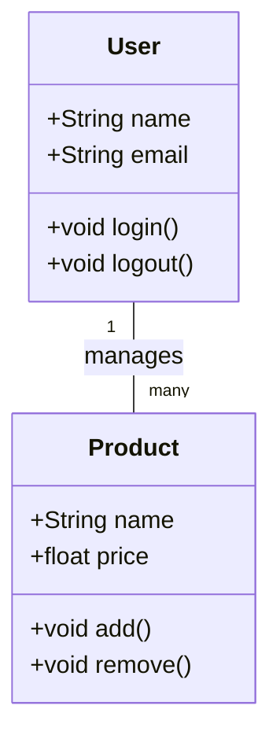

# システム設計書

## 1. はじめに
本システム設計書は、XXXXシステムの設計をまとめたものである。

## 2. 要件定義
### 2.1 機能要件
- ユーザー管理機能
  - ユーザー登録
  - ログイン/ログアウト
- 商品管理機能
  - 商品追加
  - 商品編集

### 2.2 非機能要件
- パフォーマンス要件
  - レスポンスタイム: 2秒以内
- セキュリティ要件
  - HTTPS対応

## 3. クラス図

