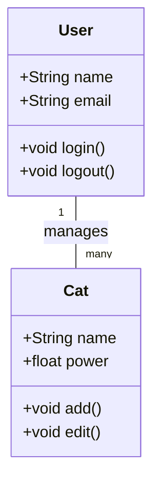

# システム設計書

## 1. はじめに
本システム設計書は、ネコネコシステムの設計をまとめたものである。

## 2. 機能一覧
- ユーザー管理機能
  - ユーザー登録
  - ログイン/ログアウト
- 猫管理機能
  - 猫情報追加
  - 猫情報編集

## 3. クラス図

```mermaid
classDiagram
class User {
    +String name
    +String email 
    +void login() 
    +void logout()
}
class Cat {
    +String name
    +float power
    +void add()
    +void edit()
} 
User "1" -- "many" Cat : manages
```