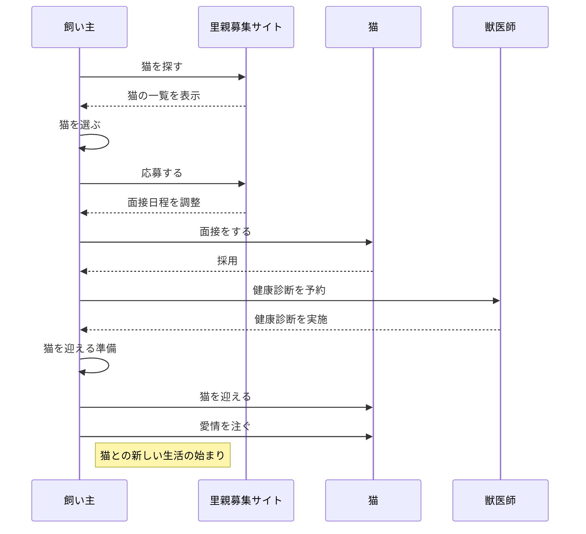

# 猫を飼うプロセス

## 1. はじめに
このドキュメントでは、猫を飼うプロセスをシーケンス図で示しています。

## 2. 猫を飼うプロセス

以下は、猫を飼うプロセスを示すシーケンス図です。

```mermaid
sequenceDiagram
    participant 飼い主
    participant 里親募集サイト
    participant 猫
    participant 獣医師

    飼い主->>里親募集サイト: 猫を探す
    里親募集サイト-->>飼い主: 猫の一覧を表示
    飼い主->>飼い主: 猫を選ぶ
    飼い主->>里親募集サイト: 応募する
    里親募集サイト-->>飼い主: 面接日程を調整
    飼い主->>猫: 面接をする
    猫-->>飼い主: 採用
    飼い主->>獣医師: 健康診断を予約
    獣医師-->>飼い主: 健康診断を実施
    飼い主->>飼い主: 猫を迎える準備
    飼い主->>猫: 猫を迎える
    飼い主->>猫: 愛情を注ぐ
    note right of 飼い主: 猫との新しい生活の始まり
```